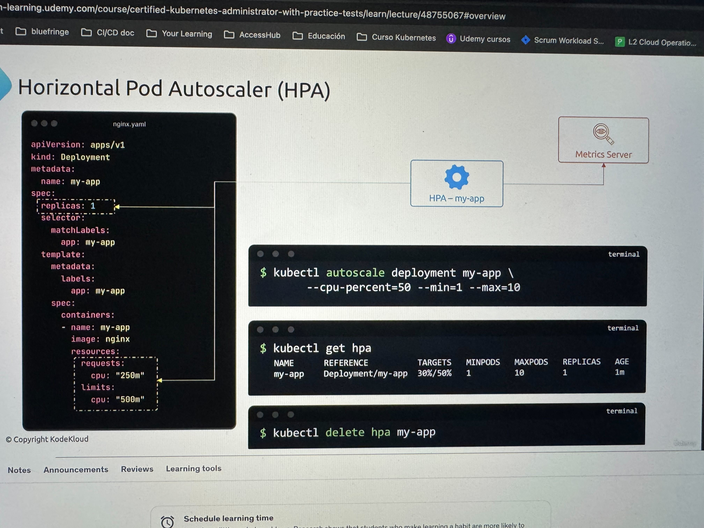
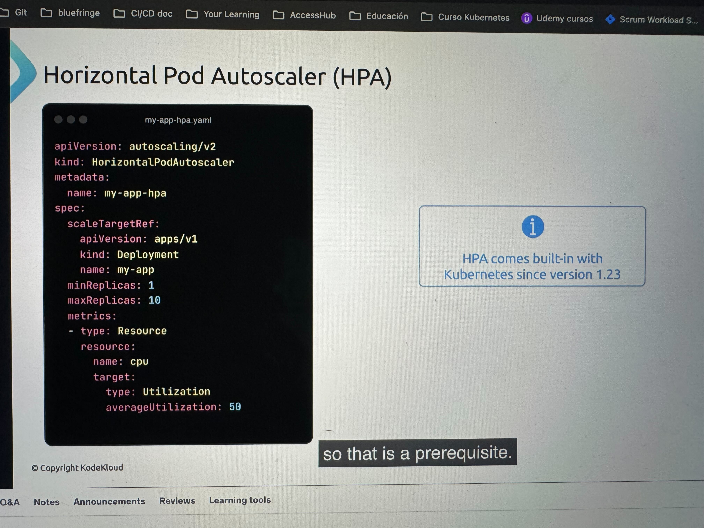
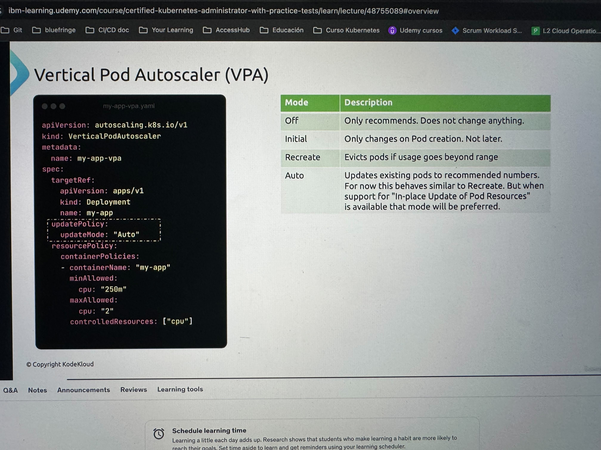
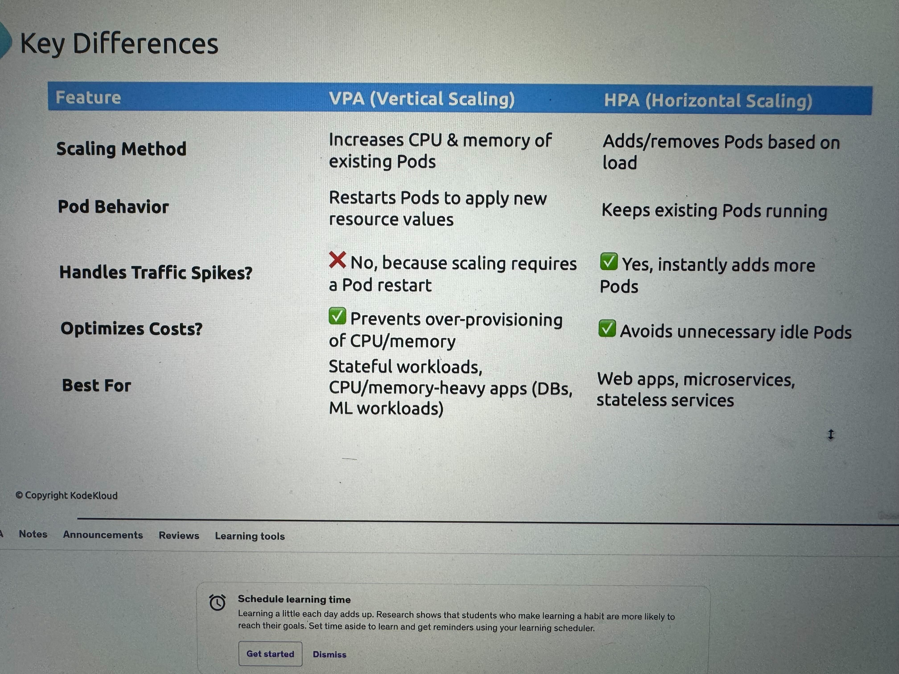

## Admission Controllers

Son plugins para configurar reglas antes de la creacion de un pod o restricciones. 
Kubernetes viene con varios plugins, pero tu también puedes crear los tuyos, por ejemplo uno que se asegure que no se corra un container como root.

Si el api server está corriendo como pod se puede hacer esto para ver los plugins

```sh
ps -ef | grep kube-apiserver | grep admission-plugins
```

### Validating Admission Controller

Se usan mas que nada para validar una accion

Un ejemplo de este es el: NamespaceLifecycle, que validate que exista el namespace y evita que se borren los 3 NS por defecto: default, kube-system, kube-public.

### Mutating Admission Controller

Mutan los recursos en base a alguna validación. Estos corren antes de los validation por si los validation deben checar algo ya este actualizado.

Un ejemplo de este es el: DefaultStorageClass que le pone un storage class por defecto a los PVC cuando no tienen uno especificado.

## HPA (Horizontal Pod Autoscaler)

Utiliza el metric-server para obtener metricas de los pods

Si te aparece como `unknown` es porque hpa no puede obtener las metricas y puede ser porque no esta definido en el deployment los cpu request and limits





## VPA (Vertical Pod Autoscaler)

### Instalar

- Step 1: Install VPA Custom Resource Definitions (CRDs)
- Step 2: Install VPA Role-Based Access Control (RBAC)



**Ejemplo**

```yaml
apiVersion: "autoscaling.k8s.io/v1"
kind: VerticalPodAutoscaler
metadata:
  name: flask-app
spec:
  targetRef:
    apiVersion: "apps/v1"
    kind: Deployment
    name: flask-app-4
  updatePolicy:
    updateMode: "Off"  # You can set this to "Auto" if you want automatic updates
  resourcePolicy:
    containerPolicies:
      - containerName: '*'
        minAllowed:
          cpu: 100m
        maxAllowed:
          cpu: 1000m
        controlledResources: ["cpu"]
```

**Explicación de que significa cada parte de cuando haces un describe**

- `containerName`: flask-app-4: La recomendación se aplica al contenedor llamado flask-app-4.
- `lowerBound (cpu: 100m)`: Este es el valor mínimo de CPU que el contenedor puede utilizar. En este caso, es 100 milicores de CPU (100m), lo que equivale al 10% de una CPU completa.
- `target (cpu: 296m)`: Este es el valor recomendado de uso de CPU. El contenedor debe operar en promedio utilizando 296 milicores de CPU (0,296 CPU).
- `uncappedTarget (cpu: 296m)`: Esto indica que no hay un límite superior explícito para el valor recomendado de CPU, es decir, el contenedor puede usar hasta este valor de forma flexible sin restricciones.
- `upperBound (cpu: “1”)`: Este es el valor máximo recomendado de CPU para el contenedor, lo que significa que el contenedor puede usar hasta 1 CPU completa (1000m).

```yaml
status:
  conditions:
  - lastTransitionTime: "2025-02-27T21:03:20Z"
    status: "True"
    type: RecommendationProvided
  recommendation:
    containerRecommendations:
    - containerName: flask-app-4
      lowerBound:
        cpu: 100m
      target:
        cpu: 296m
      uncappedTarget:
        cpu: 296m
      upperBound:
        cpu: "1"
```

## VPA vs HPA

