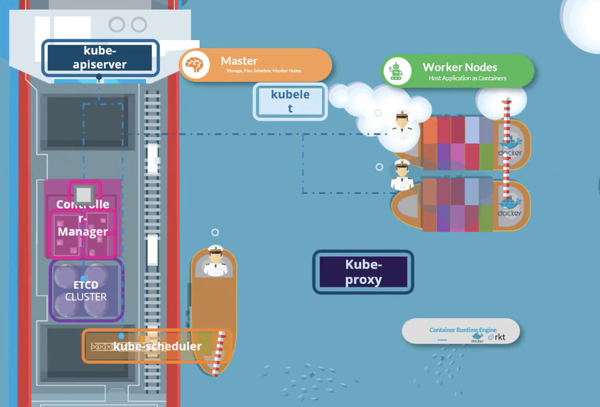

- Un container engine (agente) debe estar instalado en todos los nodos (por ejemplo Docker, containerd o Rocket)

### Worker Nodes

Trackea y monitorea los containers. Sirven para distribuir la carga.

### Kubelet

Corre en cada nodo del cluster y espera instrucciones del kubeapi server y crea o destruye containers.
Primero el kubeapi server le pregunta al scheduler en que nodo poner cierto pod, y después el kubeapi server le dice al kubelet para crearlo.
Este lo crea, descargando la imagen y creando el container. No viene instalado por defecto con kubeadmn, tienes que instalarlo a mano en cada nodo.

Contiene cAdvisor que se encarga de recolectar metricas del nodo y los pods.

### Kube proxy

Se asegura que haya reglas necesarias en los worker nodes para permitir que los containers que están corriendo puedan alcanzar otros en otro worker node.
Configura por ejemplo iptables en cada nodo, para poder "configurar" los kubernetes service y los containers se puedan conectar entre nodos.

### Master Node

Responsable del manejo del cluster y guarda información sobre los worker nodes, qué container va en qué worker node. Tiene el control plane.
Contiene etcd, que es una DB (key-valu) que guarda información sobre todo: nodos, pods, secrets, configmaps, etc. Cuando utilizas kubectl estás interactuando por debajo con etcd.

#### kube scheduler

Identifica en qué worker node se pondrá un container en base a la capacidad de los nodos y al tamaño del conatiner a crear. 
Se basa en filtrar los nodos en base a los requerimientos, por ejemplo filtra por resources y después los prioriza en base a un ranking.

#### Controller Manager

Contiene adentro varios controllers: replication controller, node-controller, etc.
Viene instalado por defecto con todos, pero se puede configurar al gusto, como quitar alguno o configurar algún parametro.
**Node controller**: nodos, hacer onboarding de meter nuevos nodos al cluster, manejar cuando un nodo ya no funciona o se borra
**Replication controller**: Se encarga de decidir el número de containers corriendo.

#### Kube Api

Primary management component, orquesta todas las operaciones dentro del cluster:

- Autentifica al usuario
- Valida la request
- Obtiene información
- Actualiza el etcd
- Llama al scheduler para saber qué nodo usar
- Llama al agente para que cree el pod en el worker node

**Container Runtime Interface (CRI)**: Permite a cualquier agente para funcionar como el container runtime de k8s

- ctr: Correr containers con containerd por separado
- nerdtcl: Es mejorcito
- crictl: serve para cualquier container runtime que es el CRI compatible (como rocket)

**Kubectl**
- El kubectl interactua con el kube api server

