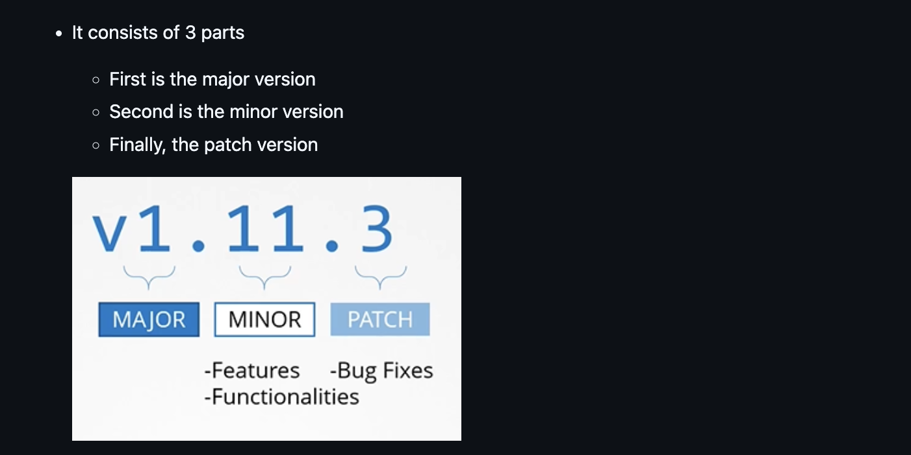
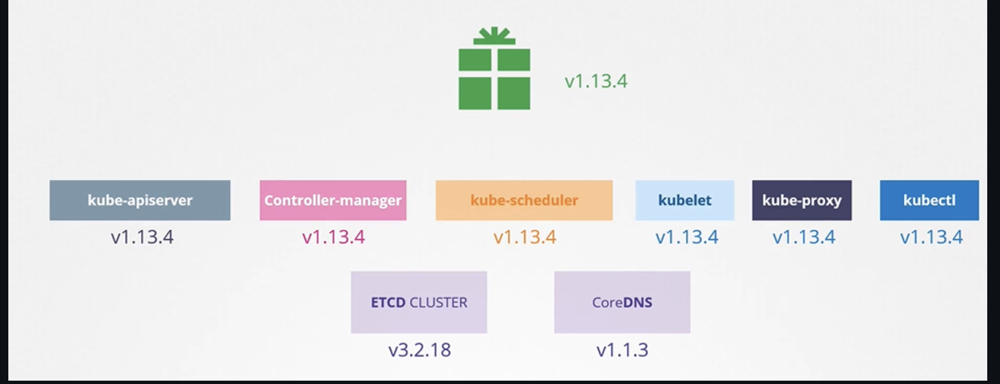

- Si un nodo está caido por mas de 5 minutos, los pods morirán, pero si existen replicas se crearán los pods que se murieron en algun otro nodo disponible. Si no hay replicas se morirá para siempre.
- Para mover los pods a otro nodo se utiliza este comando: `kubectl drain node-1`. Esto también lo marca como **Unschedulable**
- Cuando el nodo regrese en linea, se require correr el `kubectl uncordon node-1`
- Si corres solamente el `kubectl cordon node-1` esto unicamente lo marca como **Unschedulable** pero no mueve pods a otro nodo.

## K8s Software Versions



Existen también versiones alpha y beta. Ejemplo:

- `V1.10.0-alpha`: Estas versiones están en constante desarrollo, pueden cambiar en cualquier momento y se pueden romper. Estan desactivadas por defecto y no se recomiendan para prod.
- V1.10.0-beta`: Son mas estables y no tienen tantos cambios. Ya han sido testeadas y sí están habilitadas por defecto y se consideran seguras para prod.

El paquete de kubernetes que se descarga tiene todos los componentes de Kubernetes excepto ETCD Cluster y CoreDNS, ya que son proyectos separados



## Cluster Upgrade

¿Es obligatorio que todos los componentes de Kubernetes tengan las mismas versiones?
No, los componentes pueden tener distintas versiones de lanzamiento.

**Nota**: Kubernetes solo da soporte a las últimas 3 version

**Nota**: Para hacer upgrades es recomendable hacerlo de una en una

Existen 3 diferentes estrategias disponibles para hacer upgrade de los worker nodes:

1. Hacer el upgrade en todos los nodos a la vez. Con desventaja de que las aplicaciones dejerían de funcionar
2. Hacerlo nodo por nodo
3. Agregar un nodo extra con la version nueva, mover las apps y matar el nodo viejito.

## Kubeadm upgrade

Asegurate que drenaste el nodo que vas a actualizar

```sh
kubectl drain <node-to-drain> --ignore-daemonsets
```

1. Primero se debe correr este para actualizar los repositorios de donde se va a descargar kubernetes

```sh
echo "deb [signed-by=/etc/apt/keyrings/kubernetes-apt-keyring.gpg] https://pkgs.k8s.io/core:/stable:/v1.28/deb/ /" | sudo tee /etc/apt/sources.list.d/kubernetes.list
```

```sh
curl -fsSL https://pkgs.k8s.io/core:/stable:/v1.28/deb/Release.key | sudo gpg --dearmor -o /etc/apt/keyrings/kubernetes-apt-keyring.gpg
```

```sh
sudo apt-get update
```

2. Después hay que correr este, que te dirá cuales version están disponibles

```
sudo apt-cache madison kubeadm
```

3. Actualizar el kubeadm

```sh
sudo apt-mark unhold kubeadm && \
sudo apt-get update && sudo apt-get install -y kubeadm='1.30.x-*' && \
sudo apt-mark hold kubeadm
```

Se puede verificar con `kubeadm version`

4. Correr el plan, este te dará el apply a ejecutar

```sh
kubeadm upgrade plan
```

5. Por ultimo correr el apply

```sh
kubeadm upgrade apply v1.30.x
```

Se puede verificar viendo este mensaje: `SUCCESS! Your cluster was upgraded to "v1.30.x". Enjoy!`

**Nota:** Se siguen los mismos pasos para los worker nodes, con diferencia que se corre `kubeadm upgrade node` en vez de `kubeadm upgradle apply`

6. Necesitas actualizar el kubelet y el kubectl, hay que correr el drain del nodo:

**Importante:** Verifica la version de tus nodos, tendrá la version viejita aun porque usa la version del kubelet con `kubectl get nodes`

```sh
# replace x in 1.30.x-* with the latest patch version
sudo apt-mark unhold kubelet kubectl && \
sudo apt-get update && sudo apt-get install -y kubelet='1.30.x-*' kubectl='1.30.x-*' && \
sudo apt-mark hold kubelet kubectl
```
7. Reinicia los servicios

```sh
sudo systemctl daemon-reload
sudo systemctl restart kubelet
```

8. Por ultimo haz el uncordon

```sh
kubectl uncordon <node-to-uncordon>
```

Verifica que tus nodo se haya actualizado con `kubectl get nodes`
