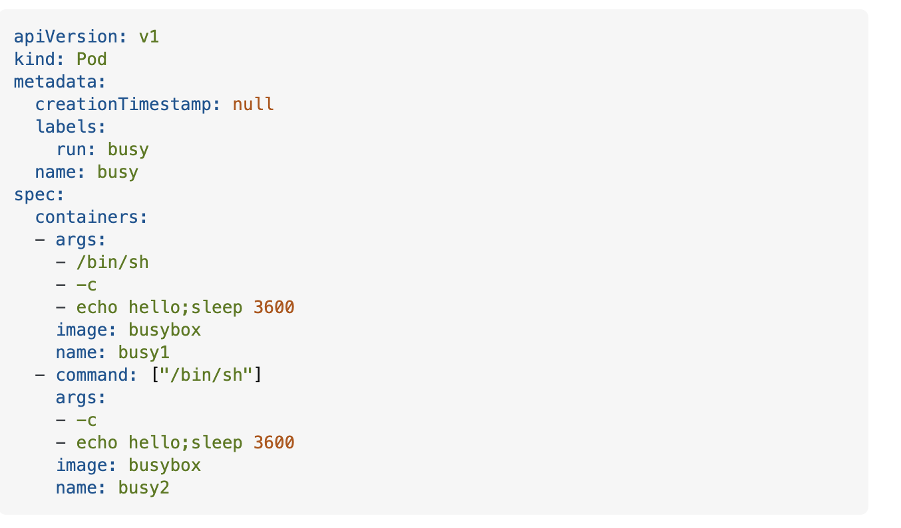
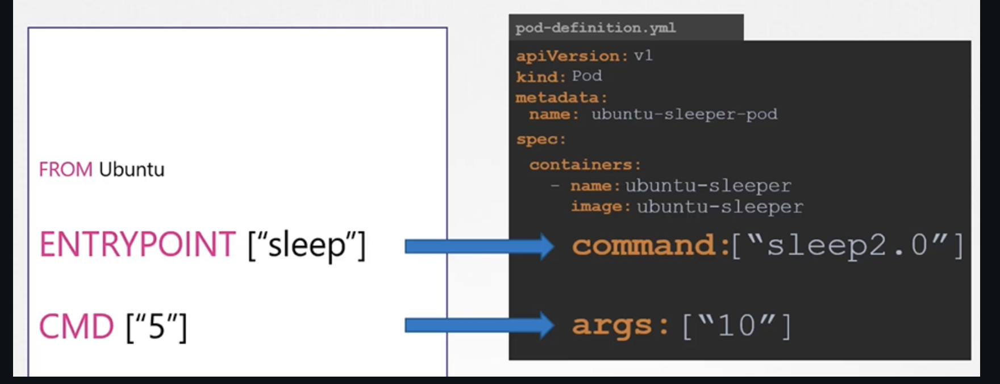

`--command -- <comando>`: Si deseas sobrecargar el comando que se ejecuta dentro del contenedor (por ejemplo, para ejecutar un proceso diferente a lo predeterminado).

```sh
kubectl run my-pod --image=nginx --command -- /bin/bash
```

```sh
kubectl run my-pod --image=nginx --command -- sleep
```


`--args`: Te permite especificar los argumentos que serán pasados al contenedor cuando se ejecute.

```sh
kubectl run my-pod --image=alpine --args=“10”
```


**Nota**: No se puede mandar ambos en el comando, puedes mandarlo con el command pero necesitas editar el pod para agregarle el arg, o viceversa.

**Nota 2**: Se puede hacer con lista (este ejemplo es multi container):




```yaml
apiVersion: v1
kind: Pod
metadata:
  name: ubuntu-sleeper-pod
spec:
 containers:
 - name: ubuntu-sleeper
   image: ubuntu-sleeper
   command: ["sleep2.0"]
   args: ["10"]
```



