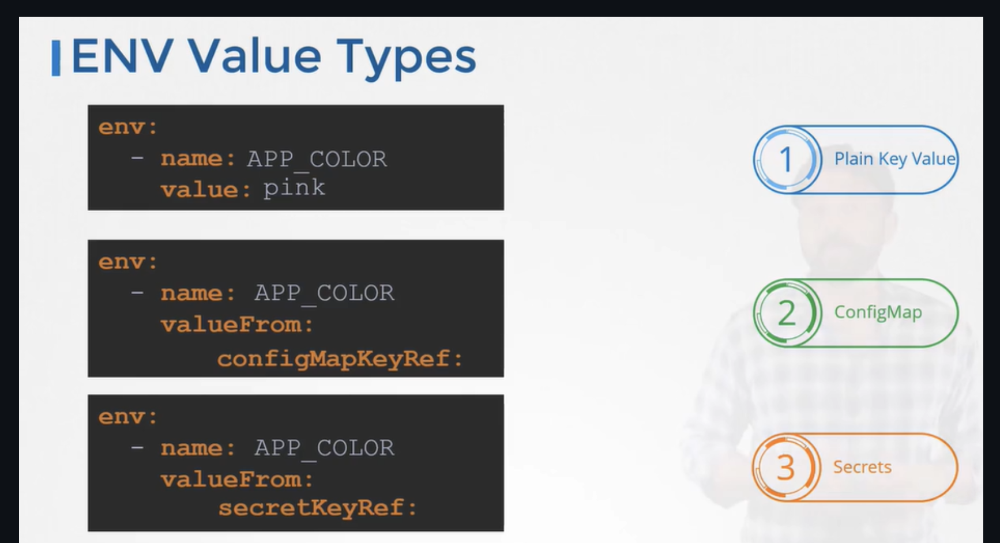

```yaml
apiVersion: v1
kind: Pod
metadata:
  name: simple-webapp-color
spec:
 containers:
 - name: simple-webapp-color
   image: simple-webapp-color
   ports:
   - containerPort: 8080
   env:
   - name: APP_COLOR
     value: pink
```

There are 3 types of envs:


Si solamente quieres una llave del configmap o secret como env en tu pod, se hace de esta forma:
```yaml
- name: UI_PROPERTIES_FILE_NAME
  valueFrom:
    configMapKeyRef:
      name: game-demo
      key: ui_properties_file_name
```
