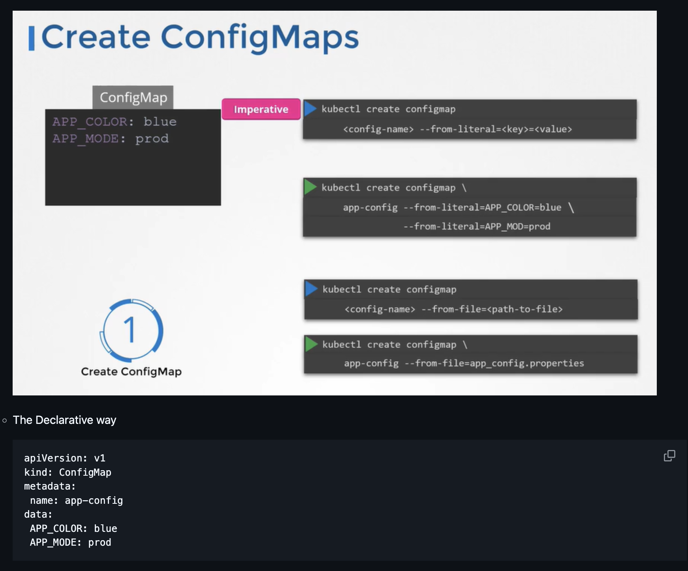
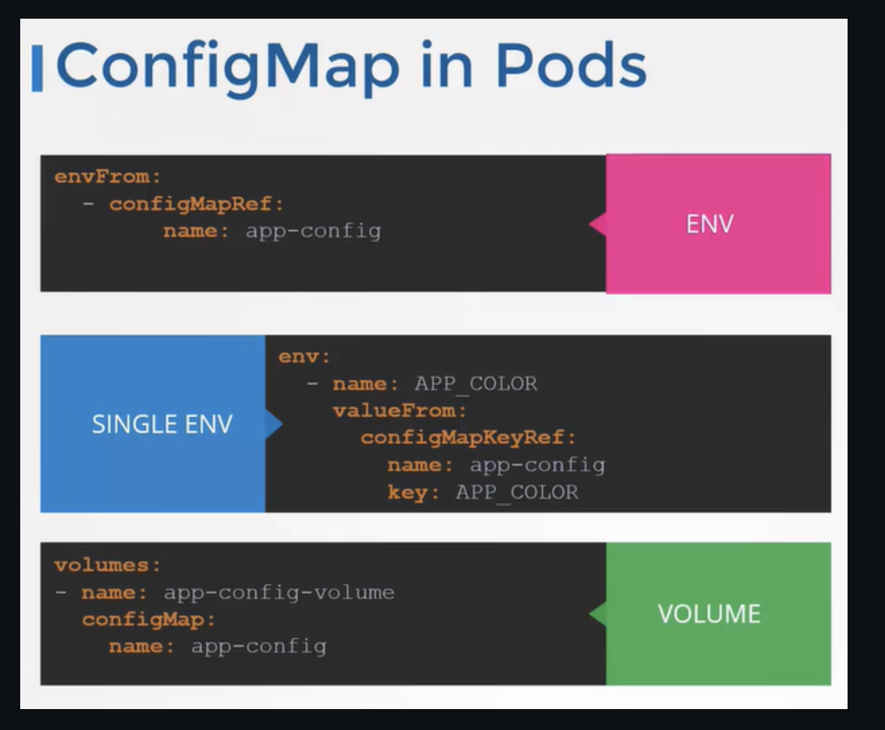
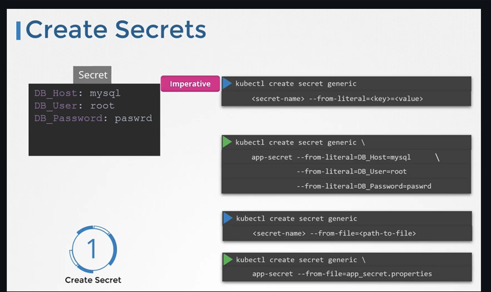
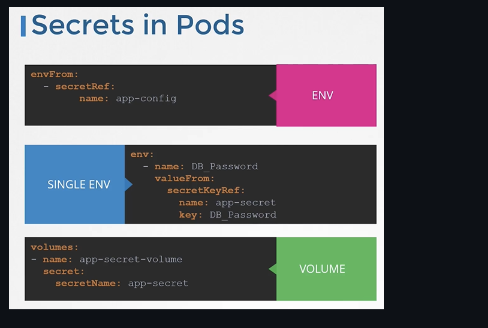

## ConfigMap

Para crear un configmap con llave-valor
```sh
kubectl create configmap app-config --from-literal=APP_COLOR=blue --from-literal=APP_MODE=prod
```

Para crear un configmap desde un archivo
```sh
kubectl create configmap app-config --from-file=app_config.properties (Another way)
```





### De tipo env
```yaml
apiVersion: v1
kind: Pod
metadata:
  name: simple-webapp-color
spec:
 containers:
 - name: simple-webapp-color
   image: simple-webapp-color
   ports:
   - containerPort: 8080
   envFrom:
   - configMapRef:
       name: app-config
```

### De single env

```yaml
- name: UI_PROPERTIES_FILE_NAME
  valueFrom:
    configMapKeyRef:
      name: game-demo
      key: ui_properties_file_name
```

### De tipo volume

```yaml
apiVersion: v1
kind: Pod
metadata:
  name: mypod
spec:
  containers:
  - name: mypod
    image: redis
    volumeMounts:
    - name: foo
      mountPath: "/etc/foo"
      readOnly: true
  volumes:
  - name: foo
    configMap:
      name: myconfigmap
```

## Secrets

```sh
kubectl create secret generic app-secret --from-literal=DB_Host=mysql --from-literal=DB_User=root --from-literal=DB_Password=paswrd
```
```sh
kubectl create secret generic app-secret --from-file=app_secret.properties
```

```yaml
apiVersion: v1
kind: Secret
metadata:
 name: app-secret
data:
  DB_Host: bX1zcWw=
  DB_User: cm9vdA==
  DB_Password: cGFzd3Jk
```



