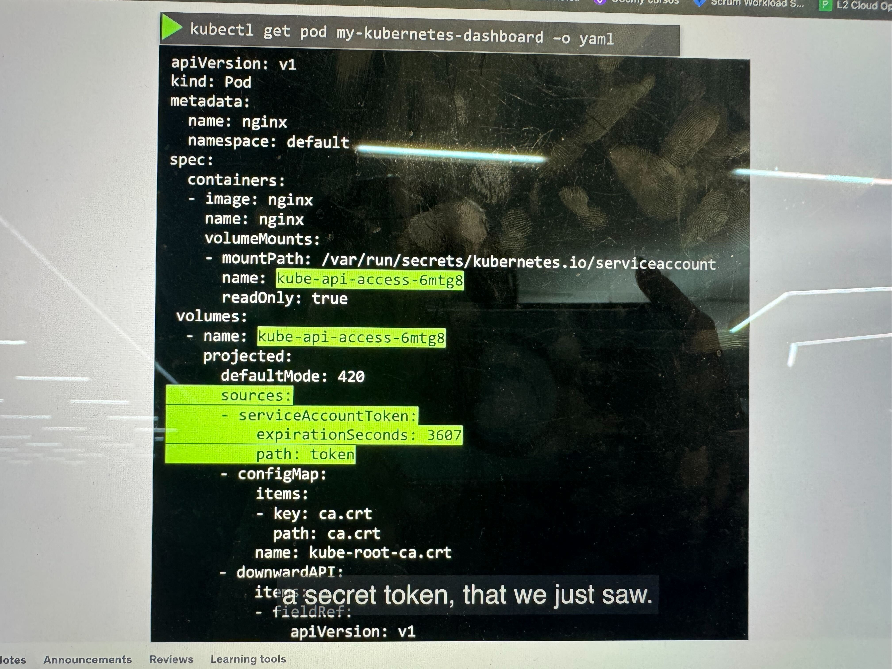
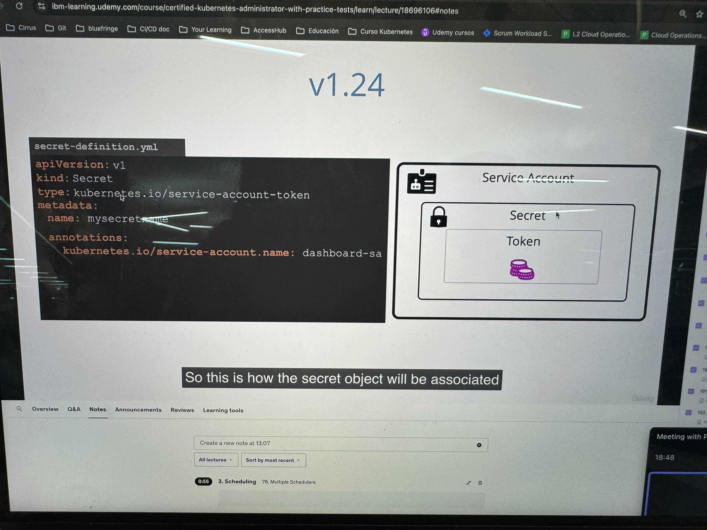

A service account is a type of non-human account that, in Kubernetes, provides a distinct identity in a Kubernetes cluster.

```yaml
apiVersion: v1
kind: ServiceAccount
metadata:
  annotations:
    kubernetes.io/enforce-mountable-secrets: "true"
  name: my-serviceaccount
  namespace: my-namespace
```

- Por defecto hay un service account de default en cada namespace y se pone en todos los pods. Si no quieres poner el default puedes colocar la siguiente config

```
automountServiceAccountToken: false
```

**Version 1.20**: 

Al crear un serviceAccount te crea por defecto un secret con el token y se monta en los pods. El token no expira


**Version 1.22**:

Creas un service account que se monta en la direccion del token, este token expira



**Version 1.24**:

Creas el service account pero tambien creas el secret, si es que quieres usar la antigua manera como la 20 pero en el secret tendras que ligar el service account




Para ver el token de un pod puedes ejecutar este comando

```sh
kubctl exec -it POD -- bash
cat /var/run/secrets/kubernetes.io/token
```
