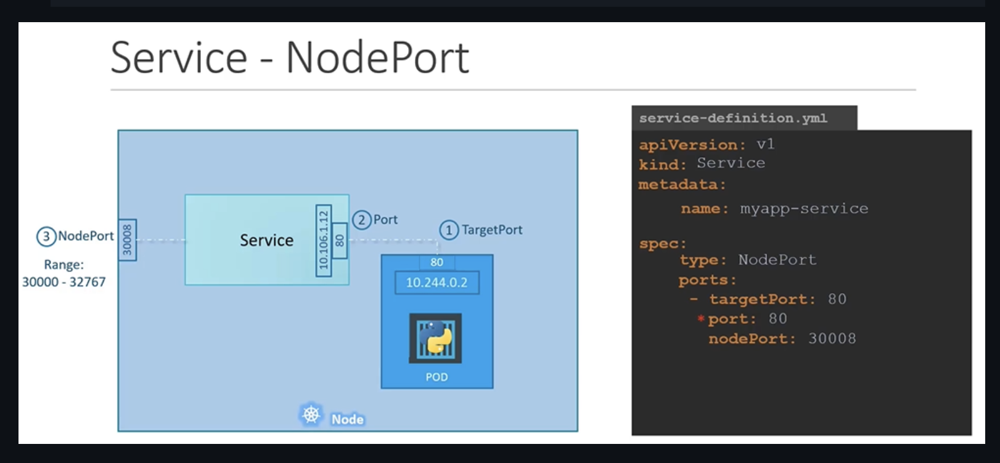

## NodePort

- Para acceder desde tu compu a un pod
- Rango válido para un nodeport: 30000 --> 32767
- Solo es requerido `port`. El `targetPort` si no se pone, se usa el mismo que el port. `nodePort` si no se pone se usa uno randon dentro del rango.
- En un solo nodo: automatcamente se hace random load balancing a todos los pods que hagan match con el selector
- En varios nodos: se crea un service con el mismo `nodePort` en todos los nodos y se puede acceder con cualquier IP de cualquier nodo.

## ClusterIP

- Para comunicación dentro del cluster, no para acceder desde afuera
- Te agrupa tus pods en un service, al que se puede referir usando el service name.

