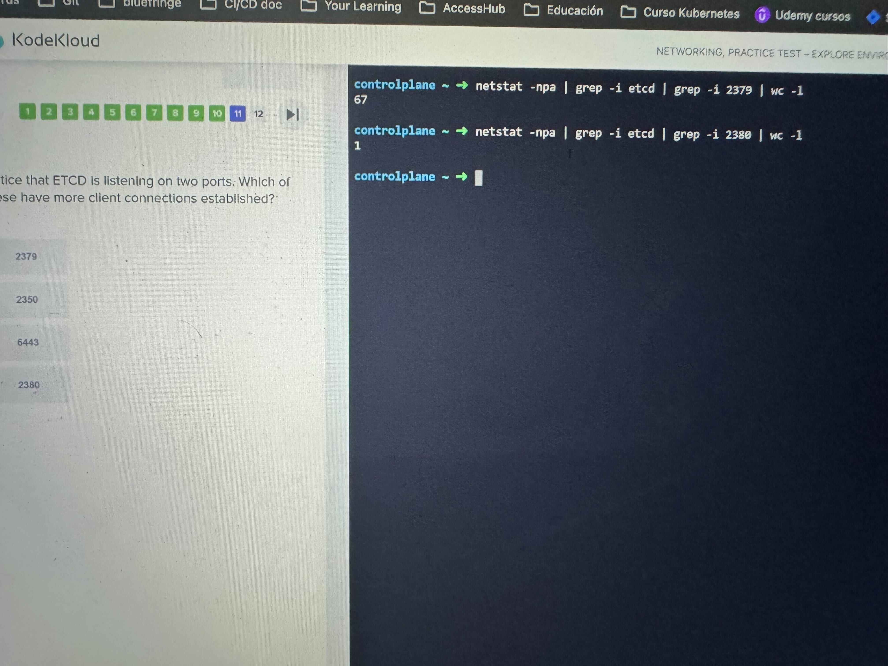
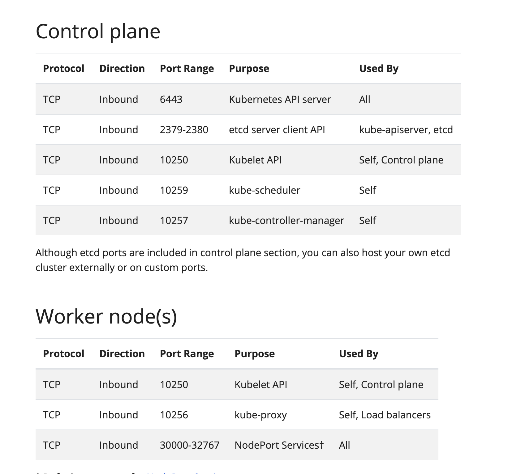
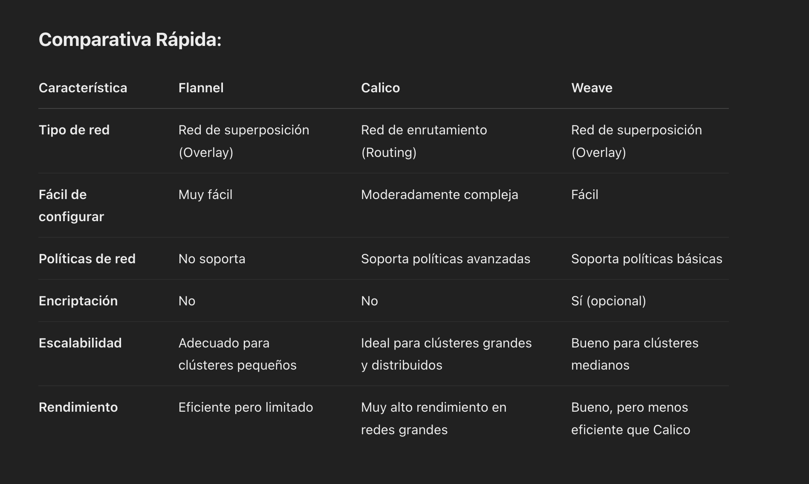
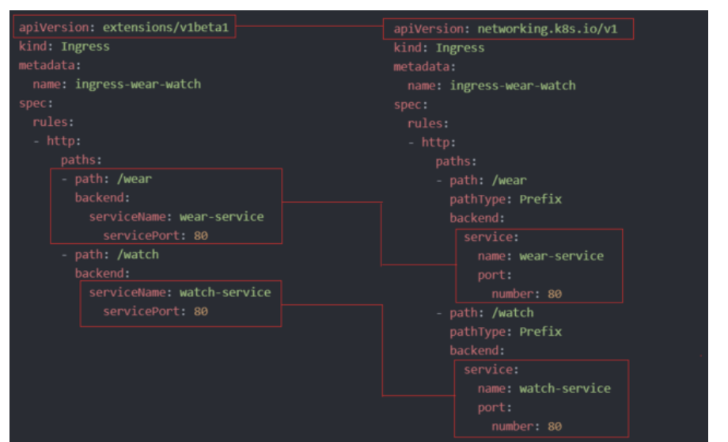
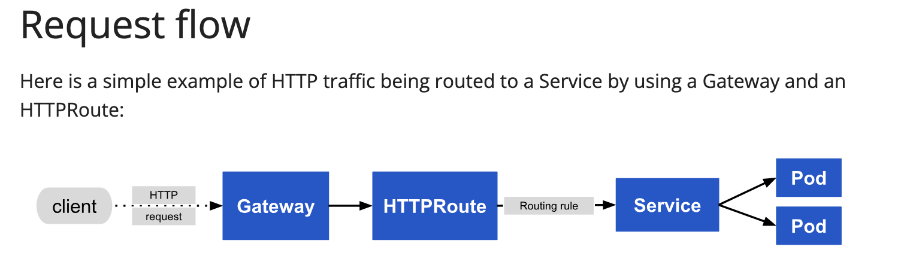
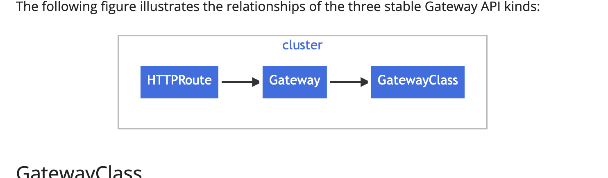

Este comando te ayuda a saber cual es el default gateway de un sistema:

```sh
ip route show default
```

Y para ver las interfaces de red: 

```sh
ip link
```

O más especificamente:

```sh
controlplane ~ ➜  ip link show cni0 
5: cni0: <BROADCAST,MULTICAST,UP,LOWER_UP> mtu 1360 qdisc noqueue state UP mode DEFAULT group default qlen 1000
    link/ether 5e:8c:d4:cc:64:d9 brd ff:ff:ff:ff:ff:ff
```

Para ver la internaz del bridge:

```sh
ip adress show type bridge
```

Para en general ver las rutas:

```sh
ip route
```

Para saber cuantas conexiones hay establecidas para un proceso de red:

```sh
netstate -npl | grep -i scheduler
```



## Puertos por defecto de K8s 



## CNI

Para checar los plugins de CNI soportados, se puede revisar:

```sh
ls /opt/cni/bin
```

Para checar que plugin usa el kubelet:

```sh
ls /etc/cni/net.d
```

### Que maneja Kubeadm y qué no?

Lo que maneja kubeadm automáticamente:
Cuando configuras un cluster con kubeadm, este se encarga de gran parte de la configuración de networking:

1. Configuración básica del plano de control: Establece los componentes principales como API Server, etcd, etc.
2. Instalación del CNI (Container Network Interface): kubeadm prepara el cluster para usar un plugin de red, pero necesitarás instalarlo explícitamente.
3. Configuración de kube-proxy: Este componente implementa las reglas de red para los servicios (incluyendo ClusterIP).
4. Configuración del DNS interno: Configura CoreDNS para la resolución de nombres dentro del cluster.

Lo que necesitas configurar manualmente:

1. Seleccionar e instalar un plugin CNI: Después de inicializar el cluster con kubeadm, debes instalar un plugin de red como Calico, Flannel, Weave, etc. Esto es lo que realmente implementa la comunicación pod-a-pod entre nodos.

    ```sh
    # Ejemplo con Calico
    kubectl apply -f https://docs.projectcalico.org/manifests/calico.yaml
    ```

2. Configuración de servicios: Los servicios como ClusterIP se crean mediante manifiestos de Kubernetes, no requieren configuración manual de IP a bajo nivel.

Entonces, ¿necesitas hacer ambos?
No necesitas configurar manualmente las direcciones IP con comandos como `ip addr` en un cluster de producción. Las herramientas como kubeadm y los plugins CNI manejan toda la configuración de red de bajo nivel.
Lo que sí necesitas hacer es:

1. Asegurarte de que tus nodos tengan conectividad de red entre sí
2. Inicializar el cluster con kubeadm
3. Instalar un plugin CNI
4. Crear tus servicios (ClusterIP, etc.) mediante manifiestos de Kubernetes

Los comandos como `ip addr` son útiles para entender y depurar cómo funciona el networking internamente, pero no son parte del flujo normal de configuración de un cluster Kubernetes.

### IPs por defecto

Las IPs privadas son 10.x.x.x, 172.x.x.x y 192.168.x.x

Los CNI comunes usan los siguientes rangos de IP para los pods:

**Calico:** Si no se configura un rango específico, Calico usa por defecto el rango 192.168.0.0/16
**Flannel:** Suele usar 10.244.0.0/16 por defecto
**Weave:** Generalmente usa 10.32.0.0/12 por defecto, se puede cambiar con `weave launch --ipalloc-range=<rango_de_ip>`

### Comparativa



## Ingress

```sh
kubectl create ingress ingress-test --rule=“wear.my-online-store.com/wear*=wear-service:80”
```




### Requerimientos

- **Ingress controller:** Es un deployment, require poner unos labels y un configmap para tu nginx (si estás usando nginx)
- **Service:** Se require que ese ingress-controller tenga un service, ya que este es el entrypoint desde el exterior

### Ejemplos

Hace proxy de requests a `/pay` al backend `pay-service`

```yaml
apiVersion: extensions/v1beta1
kind: Ingress
metadata:
 name: test-ingress
 namespace: critical-space
 annotations:
 nginx.ingress.kubernetes.io/rewrite-target: /
spec:
 rules:
 - http:
 paths:
 - path: /pay
 backend:
 serviceName: pay-service
 servicePort: 8282
```

Hace proxy de requests que hacen match con la regex al backend

```yaml
apiVersion: extensions/v1beta1
kind: Ingress
metadata:
 annotations:
 nginx.ingress.kubernetes.io/rewrite-target: /$2
 name: rewrite
 namespace: default
spec:
 rules:
 - host: rewrite.bar.com
 http:
 paths:
 - backend:
 serviceName: http-svc
 servicePort: 80
 path: /something(/|$)(.*)
```

**Nota Importante**

Existen anotaciones especificas por controller, por ejemplo para nginx esta anotación es importante:

```yaml
namespace: critical-space
annotations:
    nginx.ingress.kubernetes.io/rewrite-target: /
```

Lo que hace es que al proxied service no le agrega el path que se haya configurado en el ingress.
Por ejemplo, el usuario accede a: https://midominio.com/app/login

- En el ingress está configurado un path `/app`
- Se hace un rewrite: `/app/login` --> `/login`
- El backend tiene configurado una ruta de `/login` y responde correctamente:
    
    ```js
    app.get("/login", (req, res) => {
        res.send("Bienvenido al login!");
    })
    ```

## Gateway

El principal cambio del Ingress al Gateway es que el gateway tiene mas flexibilidad al momento de crear rutas y hacer el matching.

El campo `allowedRoutes` determina a que  namespace se puede habilitar las HTTPRoute, TCPRoute, o otras rutas al Gateway.
Configurando namespaces.from: All permite rutas desde todos los namespaces

El Gateway API se enfoca principalmente en protocolos HTTP, HTTPS, TLS, TCP, y UDP para el routing. **ICMP no está soportado**


### GatewayClass

En el GatewayClass se define que controller (o servicio de proxy) se va a utilizar.
Por ejemplo se podría utilizar el [nginx con gateway](http://nginx.org/gateway-controller)

```yaml
apiVersion: gateway.networking.k8s.io/v1
kind: GatewayClass
metadata:
  name: example-class
spec:
  controllerName: example.com/gateway-controller
```

### Gateway

Define una instancia de infra que se encarga del manejo del trafico, como load balancer

```yaml
apiVersion: gateway.networking.k8s.io/v1
kind: Gateway
metadata:
  name: nginx-gateway
spec:
  gatewayClassName: example-class
  Allowed Routes:
    namespaces: all
  listeners:
  - name: http
    protocol: HTTP
    port: 80
```

### HTTPRoute

Define reglas de mapeo de trafico a nivel de HTTP para el listener del Gateway a los endpoints de los servicios de backend.

```yaml
apiVersion: gateway.networking.k8s.io/v1
kind: HTTPRoute
metadata:
  name: example-httproute
spec:
  parentRefs:
  - name: example-gateway
  hostnames:
  - "www.example.com"
  rules:
  - matches:
    - path:
        type: PathPrefix
        value: /login
    backendRefs:
    - name: example-svc
      port: 8080
```



