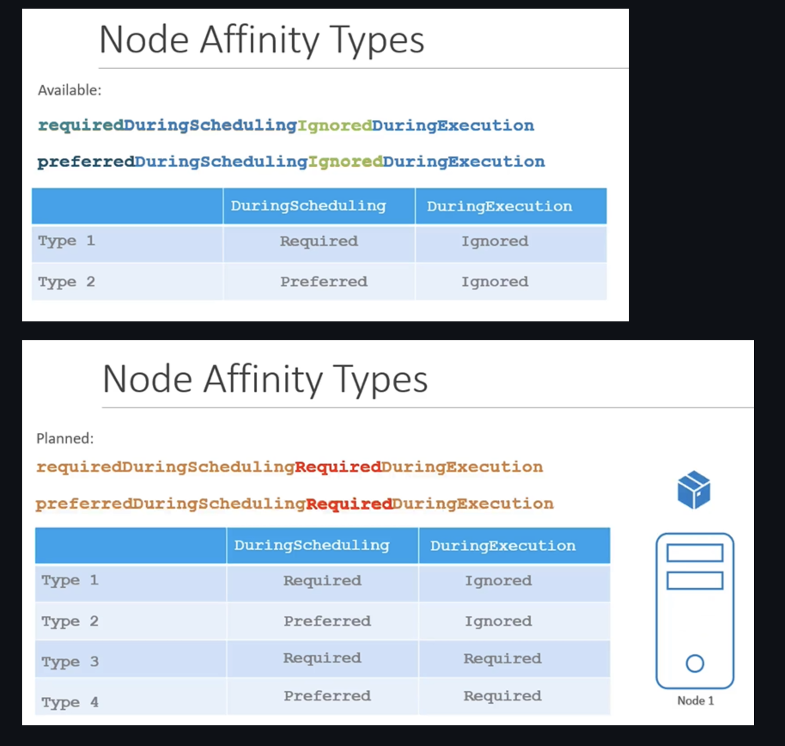

## Taint
Esto no garantiza que el pod decida a cual nodo irse, lo que hace es que el nodo pueda aceptar un pod o no 

There are 3 taint effects

- **NoSchedule**: ningun pod se va a ir a ese nodo a menos que tu hagas el toleration a el.
- **PreferNoSchedule**: intentara no ponerlo pero si no hay de otra pondra el pod ahi 
- **NoExecute**: debes poner el toleration para que se qude ahi de otra forma mata todos 

**To taint a node**

```sh
kubectl taint nodes node1 app=blue:NoSchedule
```
**To remove a taint**

```sh
kubectl taint nodes node1 key=values:NoSchedule-
```
## Selector & Labels

El pod decide a cual node irse, es  como un label a un node

```yaml
apiVersion:
kind:
metadata:

spec:
  nodeSelector:
    size: Large
```

Si algun objeto no define un `nodeSelector` entonces este se puede crear un cualquier nodo, a menos que tenga un taint.

## Node Affinity

Igual para seleccionar un nodo, pero tiene más operadores: 

- NotIn, 
- In, 
- Exists

```yaml
apiVersion: v1
kind: Pod
metadata:
 name: myapp-pod
spec:
 containers:
 - name: data-processor
   image: data-processor
 affinity:
   nodeAffinity:
     requiredDuringSchedulingIgnoredDuringExecution:
        nodeSelectorTerms:
        - matchExpressions:
          - key: size
            operator: In
            values: 
            - Large
            - Medium 
```
### Node Affinity Types

- Available
    - requiredDuringSchedulingIgnoredDuringExecution
    - preferredDuringSchedulingIgnoredDuringExecution

- Planned

    - requiredDuringSchedulingRequiredDuringExecution
    - preferredDuringSchedulingRequiredDuringExecution



