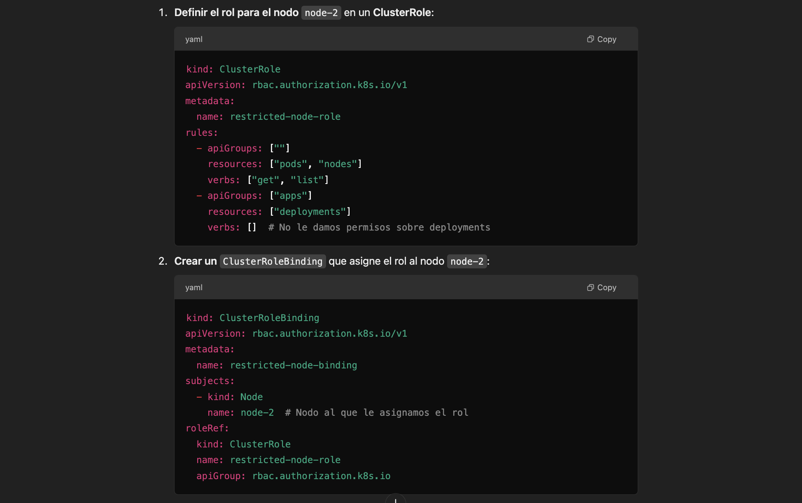

# RoleBinding vs ClusterRoleBinding

RoleBinding:
Este se usa para asignar roles a usuarios o nodos dentro de un namespace específico. Es útil cuando deseas limitar el acceso a recursos dentro de un namespace específico.

ClusterRoleBinding:
Este se usa para asignar roles a nivel de clúster. Un ClusterRoleBinding puede otorgar permisos en todos los namespaces del clúster, no solo en un namespace específico.

 
