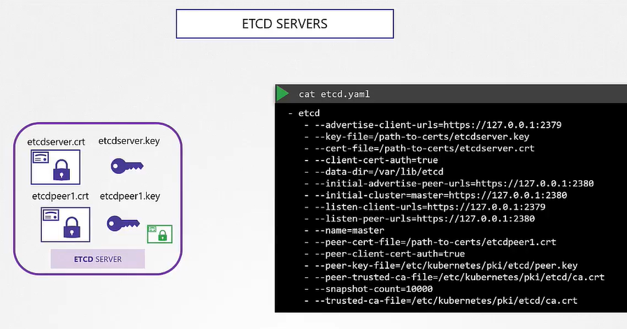
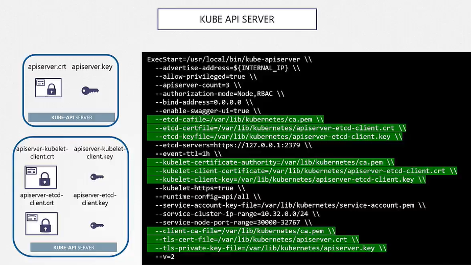
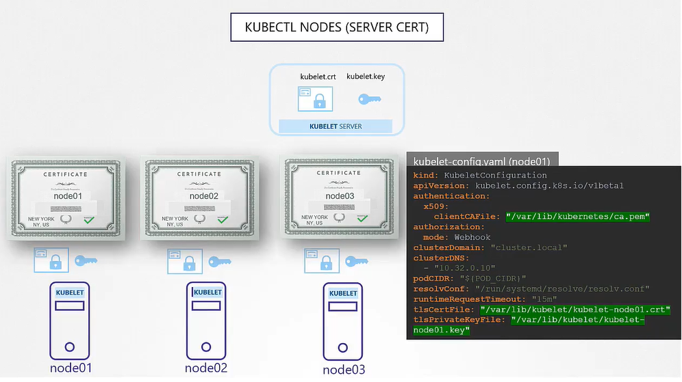

## Generar Certificados

- Hay varas tools, easyrsa, openssl or cfssl.

## Certificate Authority (CA)

- Generar Keys
  ```
  $ openssl genrsa -out ca.key 2048
  ```
- Generar CSR
  ```
  $ openssl req -new -key ca.key -subj "/CN=KUBERNETES-CA" -out ca.csr
  ```
- Firmar certificado
  ```
  $ openssl x509 -req -in ca.csr -signkey ca.key -out ca.crt
  ```

## Generar Certificados de Cliente

#### Admin User Certificado

- Generar Keys
  ```
  $ openssl genrsa -out admin.key 2048
  ```
- Generar CSR
  ```
  $ openssl req -new -key admin.key -subj "/CN=kube-admin" -out admin.csr
  ```
- Firmar certificado
  ```
  $ openssl x509 -req -in admin.csr -CA ca.crt -CAkey ca.key -out admin.crt
  ```
  
- Certificado con permisos de admin
  ```
  $ openssl req -new -key admin.key -subj "/CN=kube-admin/O=system:masters" -out admin.csr
  ```
  
#### Seguimos el mismo procedimiento para generar los certificados de cliente para los demás components que acceden al kube-apiserver


## Generar certificados de server

## ETCD Certificado del server


  
## Kube-apiserver Certificado




## Kubectl Nodes (Server Cert)




## Ver Certificados

Para ver detalles de un cert

```sh
openssl x509 -in /etc/kubernetes/pki/apiserver.crt -text -noout
```


Y para checar los logs puede ser de las siguientes maneras:

- Logs de un servicio

```sh
journalctl -u etcd.service -l
```

- Logs de un pod

```sh
kubectl logs etcd-master
```

O si no puedes ver con kubectl puedes hacerlo con docker (o crictl)
```sh
docker ps -a
docker logs <container-id>
```
