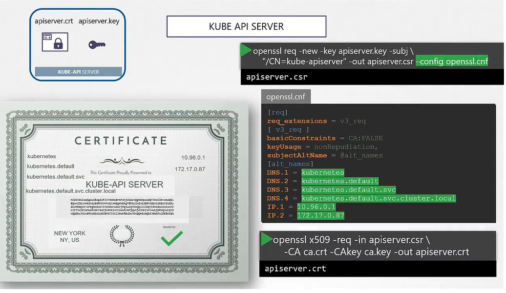

## Generar Certificados

- Hay varas tools, easyrsa, openssl or cfssl.

## Certificate Authority (CA)

- Generar Keys
  ```
  $ openssl genrsa -out ca.key 2048
  ```
- Generar CSR
  ```
  $ openssl req -new -key ca.key -subj "/CN=KUBERNETES-CA" -out ca.csr
  ```
- Firmar certificado
  ```
  $ openssl x509 -req -in ca.csr -signkey ca.key -out ca.crt
  ```

## Generar Certificados de Cliente

#### Admin User Certificado

- Generar Keys
  ```
  $ openssl genrsa -out admin.key 2048
  ```
- Generar CSR
  ```
  $ openssl req -new -key admin.key -subj "/CN=kube-admin" -out admin.csr
  ```
- Firmar certificado
  ```
  $ openssl x509 -req -in admin.csr -CA ca.crt -CAkey ca.key -out admin.crt
  ```
  
- Certificado con permisos de admin
  ```
  $ openssl req -new -key admin.key -subj "/CN=kube-admin/O=system:masters" -out admin.csr
  ```
  
#### Seguimos el mismo procedimiento para generar los certificados de cliente para los demás components que acceden al kube-apiserver


## Generar certificados de server

## ETCD Certificado del server


  
## Kube-apiserver Certificado




## Kubectl Nodes (Server Cert)


## Ver Certificados

Para ver detalles de un cert

```sh
openssl x509 -in /etc/kubernetes/pki/apiserver.crt -text -noout
```


Y para checar los logs puede ser de las siguientes maneras:

- Logs de un servicio

```sh
journalctl -u etcd.service -l
```

- Logs de un pod

```sh
kubectl logs etcd-master
```

O si no puedes ver con kubectl puedes hacerlo con docker (o crictl)
```sh
docker ps -a
docker logs <container-id>
```

## Certificate API

#### Este certificado se puede extraer y pasar al user

- El usuario crea su key
  ```sh
  openssl genrsa -out jane.key 2048
  ```
- Genera un CSR
  ```sh
  openssl req -new -key jane.key -subj "/CN=jane" -out jane.csr 
  ```
- Envia la request y el admin toma esa key y crea un objeto de tipo CSR CertificateSigningRequest y el .csr del usuario
  ```yaml
  apiVersion: certificates.k8s.io/v1beta1
  kind: CertificateSigningRequest
  metadata:
    name: jane
  spec:
    groups:
    - system:authenticated
    usages:
    - digital signature
    - key encipherment
    - server auth
    request:
      <certificate-goes-here>
  ```
  ```sh
  cat jane.csr |base64 -w 0
  kubectl create -f jane.yaml
  ```

  `-w 0` sirve para quitar los saltos de linea del base64


- Para ver los csr
  ```sh
  kubectl get csr
  ```
- Aprobar la request
  ```sh
  kubectl certificate approve jane
  ```
- Ver un certificado
  ```sh
  kubectl get csr jane -o yaml
  ```
- Para decodificarlo
  ```sh
  echo "<certificate>" |base64 --decode
  ```
  
#### Todos las operaciones de certificados las hace el contoller manager

- Si alguien tiene que firmar los certificados, deben tener los CA, root y private key del CA server. El controller manager ya tiene estas opciones
