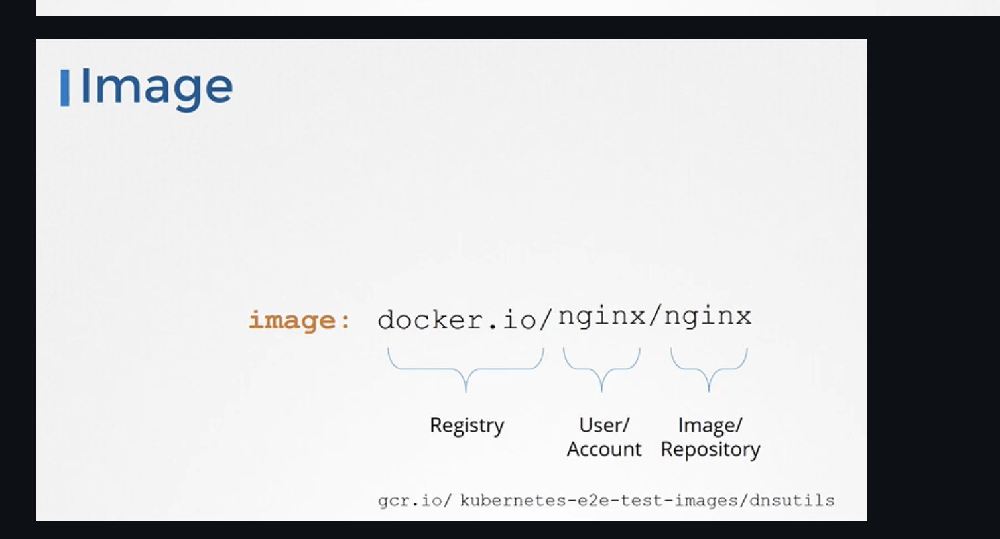
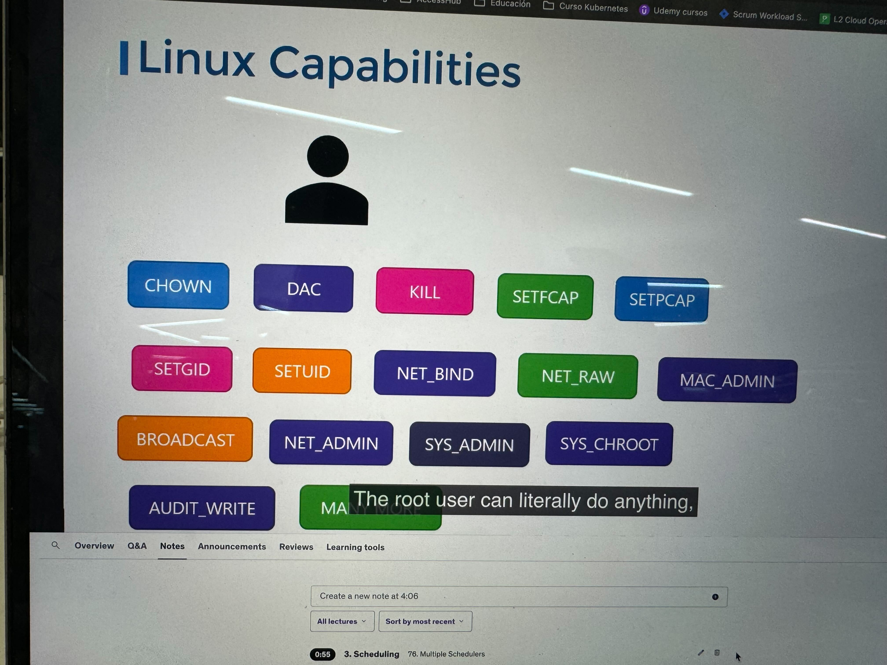

Puedes usar registries publicos como Github, Dockerhub, etc o privados usando el `imagePullSecrets`:

```yaml
apiVersion: v1
kind: Pod
metadata:
  name: nginx-pod
spec:
  containers:
  - name: nginx
    image: private-registry.io/apps/internal-app
  imagePullSecrets:
  - name: regcred
```

Para crear el secret:

```sh
kubectl create secret docker-registry regcred \
  --docker-server=private-registry.io \ 
  --docker-username=registry-user \
  --docker-password=registry-password \
  --docker-email=registry-user@org.com
```



## Security context

Para correr con un usuario específico:

```yaml
apiVersion: v1
kind: Pod
metadata:
  name: web-pod
spec:
  securityContext:
    runAsUser: 1000
  containers:
  - name: ubuntu
    image: ubuntu
    command: ["sleep", "3600"]
```

o por container:

```yaml
apiVersion: v1
kind: Pod
metadata:
  name: web-pod
spec:
  containers:
  - name: ubuntu
    image: ubuntu
    command: ["sleep", "3600"]
    securityContext:
      runAsUser: 1000
```

Para usar capabilities:

```yaml
apiVersion: v1
kind: Pod
metadata:
  name: web-pod
spec:
  containers:
  - name: ubuntu
    image: ubuntu
    command: ["sleep", "3600"]
    securityContext:
      runAsUser: 1000
      capabilities: 
        add: ["MAC_ADMIN"]
```


