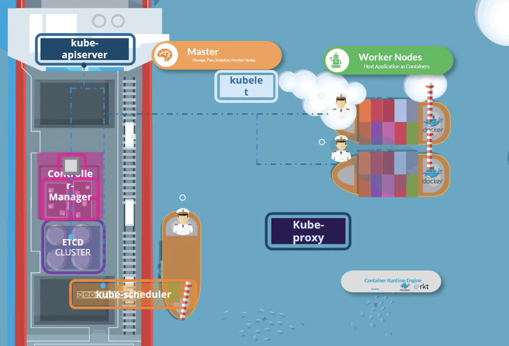
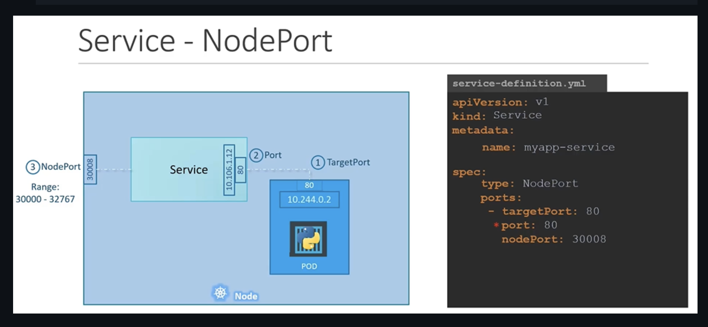
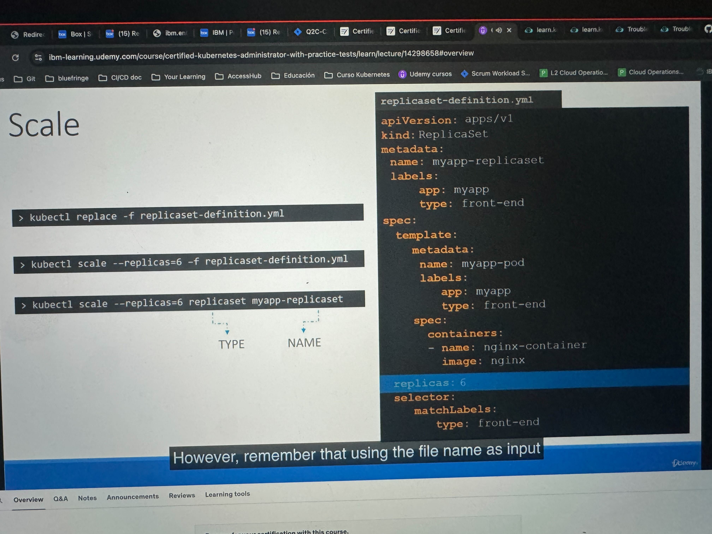
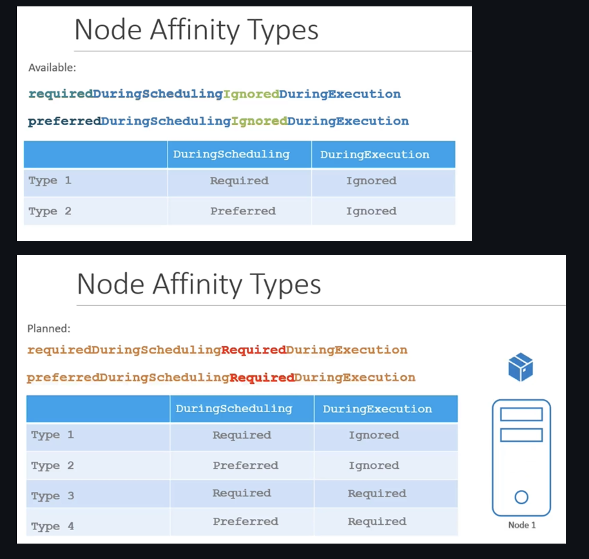

# Certified Kubernetes Administrator

## Cluster Architecture



- Un container engine (agente) debe estar instalado en todos los nodos (por ejemplo Docker, containerd o Rocket)

### Worker Nodes

Trackea y monitorea los containers. Sirven para distribuir la carga.

### Kubelet

Corre en cada nodo del cluster y espera instrucciones del kubeapi server y crea o destruye containers.
Primero el kubeapi server le pregunta al scheduler en que nodo poner cierto pod, y después el kubeapi server le dice al kubelet para crearlo.
Este lo crea, descargando la imagen y creando el container. No viene instalado por defecto con kubeadmn, tienes que instalarlo a mano en cada nodo.

### Kube proxy

Se asegura que haya reglas necesarias en los worker nodes para permitir que los containers que están corriendo puedan alcanzar otros en otro worker node.
Configura por ejemplo iptables en cada nodo, para poder "configurar" los kubernetes service y los containers se puedan conectar entre nodos.

### Master Node

Responsable del manejo del cluster y guarda información sobre los worker nodes, qué container va en qué worker node. Tiene el control plane.
Contiene etcd, que es una DB (key-valu) que guarda información sobre todo: nodos, pods, secrets, configmaps, etc. Cuando utilizas kubectl estás interactuando por debajo con etcd.

#### kube scheduler

Identifica en qué worker node se pondrá un container en base a la capacidad de los nodos y al tamaño del conatiner a crear. 
Se basa en filtrar los nodos en base a los requerimientos, por ejemplo filtra por resources y después los prioriza en base a un ranking.

#### Controller Manager

Contiene adentro varios controllers: replication controller, node-controller, etc.
Viene instalado por defecto con todos, pero se puede configurar al gusto, como quitar alguno o configurar algún parametro.
**Node controller**: nodos, hacer onboarding de meter nuevos nodos al cluster, manejar cuando un nodo ya no funciona o se borra
**Replication controller**: Se encarga de decidir el número de containers corriendo.

#### Kube Api

Primary management component, orquesta todas las operaciones dentro del cluster:

- Autentifica al usuario
- Valida la request
- Obtiene información
- Actualiza el etcd
- Llama al scheduler para saber qué nodo usar
- Llama al agente para que cree el pod en el worker node

**Container Runtime Interface (CRI)**: Permite a cualquier agente para funcionar como el container runtime de k8s

- ctr: Correr containers con containerd por separado
- nerdtcl: Es mejorcito
- crictl: serve para cualquier container runtime que es el CRI compatible (como rocket)

## Pods

Los siguentes 4 valores son requeridos:

```yaml
apiVersion:
kind:
metadata:

spec:
```

Si no hay un scheduler tu puedes asignarlo directamente en el yaml con:
nodeName:
o creando un archivo de tipo Binding y pasandolo por un http request

## Services

### NodePort

- Para acceder desde tu compu a un pod
- Rango válido para un nodeport: 30000 --> 32767
- Solo es requerido `port`. El `targetPort` si no se pone, se usa el mismo que el port. `nodePort` si no se pone se usa uno randon dentro del rango.
- En un solo nodo: automatcamente se hace random load balancing a todos los pods que hagan match con el selector
- En varios nodos: se crea un service con el mismo `nodePort` en todos los nodos y se puede acceder con cualquier IP de cualquier nodo.



### ClusterIP

- Para comunicación dentro del cluster, no para acceder desde afuera
- Te agrupa tus pods en un service, al que se puede referir usando el service name.

## ReplicaSet




### Taint
Esto no garantiza que el pod decida a cual nodo irse, lo que hace es que el nodo pueda aceptar un pod o no 

There are 3 taint effects

- NoSchedule: ningun pod se va a ir a ese nodo a menos que tu hagas el toleration a el.
- PreferNoSchedule: intentara no ponerlo pero si no hay de otra pondra el pod ahi 
- NoExecute: debes poner el toleration para que se qude ahi de otra forma mata todos 

**To taint a node**

```sh
kubectl taint nodes node1 app=blue:NoSchedule
```
**To remove a taint**

```sh
kubectl taint nodes node1 key=values:NoSchedule-
```
### Selector & Labels

El pod decide a cual node irse, es  como un label a un node

```yaml
apiVersion:
kind:
metadata:

spec:
  nodeSelector:
    size: Large
```

Si algun objeto no define un `nodeSelector` entonces este se puede crear un cualquier nodo, a menos que tenga un taint.

### Node Affinity

Igual para seleccionar un nodo, pero tiene más operadores: 

- NotIn, 
- In, 
- Exists

```yaml
apiVersion: v1
kind: Pod
metadata:
 name: myapp-pod
spec:
 containers:
 - name: data-processor
   image: data-processor
 affinity:
   nodeAffinity:
     requiredDuringSchedulingIgnoredDuringExecution:
        nodeSelectorTerms:
        - matchExpressions:
          - key: size
            operator: In
            values: 
            - Large
            - Medium 
```
#### Node Affinity Types

- Available
    - requiredDuringSchedulingIgnoredDuringExecution
    - preferredDuringSchedulingIgnoredDuringExecution

- Planned

    - requiredDuringSchedulingRequiredDuringExecution
    - preferredDuringSchedulingRequiredDuringExecution




## Comandos útiles

**Correr pod sin usar yaml**

```sh
kubectl run nginx --image=nginx
```

**Crear un pod y agregarle un label**

```sh
kubectl run redis --image=redis:alpine -l tier=db
```

**Crear un service para exponer un pod**

```sh
kubectl expose pod redis --port=6379 --name redis-service
```

**Crear un deployment con 3 replicas**

```sh
kubectl create deployment webapp --image=kodekloud/webapp-color --replicas=3
```

**Crear un pod y exponerlo en el puerto 8080 (solo exponer el pod, no crea un servicio)**

```sh
kubectl run custom-nginx --image=nginx --port=8080
```

**Crea un nuevo namespace**

```sh
kubectl create ns dev-ns
```

**Crear un deployment en un namespace con 2 replicas**

```sh
kubectl create deployment redis-deploy -n dev-ns --image redis --replicas 2
```

**Crea un pod y crea un service de tipo ClusterIP automaticamente**

```sh
kubectl run httpd --image httpd:alpine --expose --port 80
```

**Simula crear un deployment y te da el yaml**

```sh
kubectl create deployent --image=nginx nginx --replicas=4 --dry-run=client -o yaml > nginx-deployment.yaml
```

**Cambiarte de namespace**

```sh
kubectl config set-context --current --namespace=<namespace>
```

**Obtener el current namespace**

```sh
kubectl config view | grep namespace
```

**Actualizar un pod**

```sh
kubectl replace --force -f nginx.yaml
```

**cuenta cuantos pods, eliminando la columna**
```sh
kubectl get pod --selector env=prod --no-headers | wc -l
```

**Aplicar un label a un nodo**

```sh
kubectl label nodes node01 key=value
```

**To apply a label to a node**
```sh 
kubectl label nodes node-1 size=Large
```
